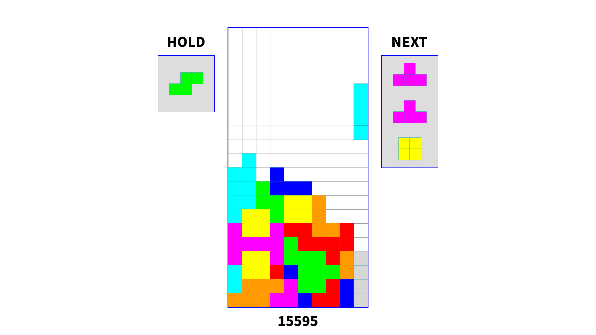
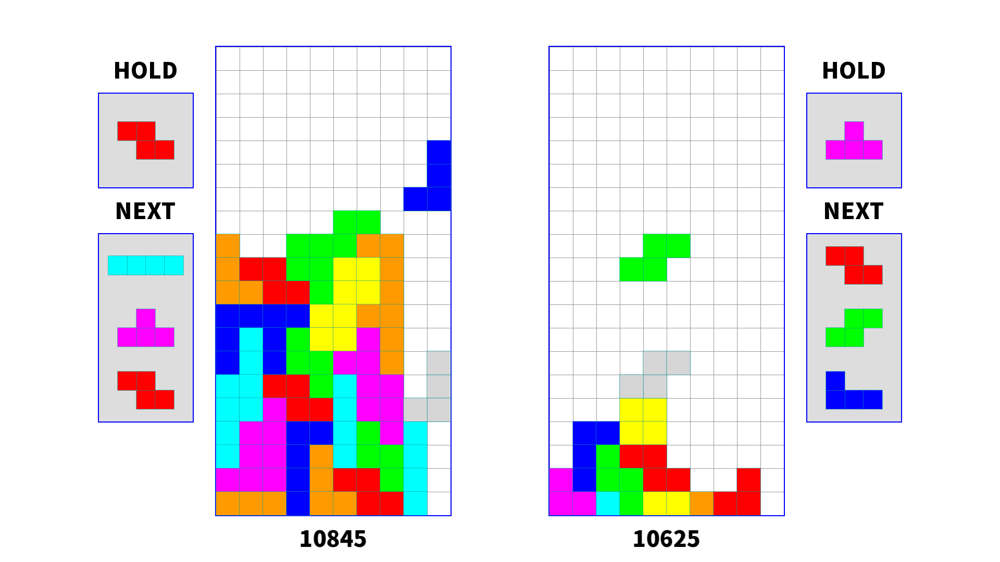

# TetrisClone
This is a clone of the game Tetris in the [modern style](https://tetrisinterest.com/modern-tetris-and-classic-tetris-what-is-the-difference/).
I completed this project as part of my Senior capstone at Plymouth State University.

The project is written in C++ and makes use of the Simple and Fast Media Library, [SFML](https://www.sfml-dev.org).

